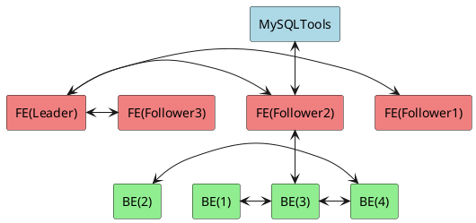

## Doris 

### 简介

Apache Doris 是一个现代化的 MPP 分析型数据库产品。
仅需亚秒级响应时间即可获得查询结果，有效地支持实时数据分析。
Apache Doris 的分布式架构非常简洁，易于运维，并且可以支持 10 PB 以上的超大数据集。

Doris 的组成架构如下所示：



### 关键概念

- FE(Frontend)：前端进程，负责如下工作
  - 存储，维护元数据
  - 接收解析查询请求
  - 规划查询计划
  - 调度查询执行
  - 返回查询结果
- BE(Backend)：后端进程，负责如下工作
  - 依据物理计划，分布执行查询
  - 存储数据，保证可靠性
- Broker：无状态进程，主要用于访问外部数据源
- Tablet：表的实际存储单元。在由 BE 组成的分布式存储层中，经过分区和分桶后，会以 Tablet 为基本单元存储一张表。每个 Tablet 包括元信息和几个连续的 RowSet。
- Rowset：Rowset 是 Tablet 中某次数据变化的数据集合，数据变化包括数据的导入、删除、更新。按版本信息记录的行集。每次更改都会生成一个版本。
- Version：由 Start 和 End 两个属性组成，维护数据变化的记录信息。通常用于表示 Rowset 的版本范围，在新导入后会生成 Start 和 End 相等的 Rowset，Compaction 后会生成具有范围的 Rowset 版本。
- Segment：表示 Rowset 中的数据段。多个 Segment 形成一个 Rowset。
- Compaction：合并连续版本的 Rowset 的过程称为 Compaction，合并过程中数据会被压缩。

FE 中还具有 Leader，Follower 和 Observer 角色的不同进程：

- Leader 和 Follower 角色使用 Paxos 协议保证了高可用。
- Observer 角色则是作为扩展的查询节点，可以增强集群在查询方面的能力。(Observer 不参与任何写入，只参与读取)。

### 安装

- 编辑最大打开的句柄数

```bash
vim /etc/security/limits.conf 
```

新增如下内容

```text
* soft nofile 65536
* hard nofile 65536
```

> 注：此处内容需要重启才能生效

- 下载软件包，并解压至指定目录

```bash
wget https://dist.apache.org/repos/dist/release/incubator/doris/<version>
# 注：例如
wget https://dist.apache.org/repos/dist/release/incubator/doris/1.0/1.0.0-incubating/apache-doris-1.0.0-incubating-bin.tar.gz

tar -zxvf apache-doris-1.0.0-incubating-bin.tar.gz
mv apache-doris-1.0.0-incubating-bin /opt/doris
cd /opt/doris
```

- 编辑 FE 配置

```bash
vim fe/conf/fe.conf
```

修改如下内容

```text
priority_networks = 127.0.0.0/24
```

- 编辑 BE 配置

```bash
vim be/conf/be.conf
```

修改如下内容

```text
priority_networks = 127.0.0.0/24
```

- 编辑环境变量

```bash
vim /etc/profile.d/doris.sh
```

填入如下内容

```text
export DORIS_HOME=/opt/doris
export PATH=$PATH:$DORIS_HOME/fe/bin:$DORIS_HOME/be/bin
```

```bash
source /etc/profile.d/doris.sh
```

- 启动服务

```bash
start_fe.sh --daemon
start_be.sh --daemon
```

- 检查服务启动情况

请根据返回内容进行判断

```bash
curl http://fe_host:fe_http_port/api/bootstrap
curl http://be_host:be_http_port/api/health
```

> 注：
> 
> fe_http_port 为 8030，WebUI 默认账号为 root，密码为空。
> 
> be_http_port 为 8040，

- 安装 MySQL 客户端

```text
yum install -y mysql
```

- 注册 BE 至 FE

登陆 Doris

```bash
mysql -h 127.0.0.1 -P 9030 -uroot
```

注册 BE

```text
ALTER SYSTEM ADD BACKEND "127.0.0.1:9050";
```

### 参考资料

[官方文档](https://doris.apache.org/)

[视频教程](https://www.bilibili.com/video/BV15S4y1h7Kt)
