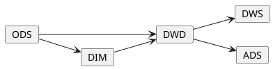
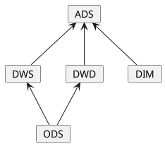

## 数据仓库概念梳理

### 简介

> 注：此处内容来源于维基百科。

在数据处理领域中，数据仓库(DW 或 DWH)，也被称为企业数据仓库(EDW)。
它是一种用于业务报告和数据分析的系统，通常被认为是商业智能(BI)的核心组件。
数据仓库是一个集成了来自于一个或者多个不同来源的系统数据的中央存储库。
它将当前和历史数据存储在一个位置，用于为整个企业的员工创建分析报告。

存储在仓库中的数据是从运营系统(如营销或者销售)上传的。
数据可能会通过 ODS 与数据清理等操作来确保数据质量，然后再用于最终的分析报告。

ETL 和 ELT 是两种建设数据仓库的主要方式。

> 注：提取(Extract)、转换(Transform)、加载(Load)

### 数仓分层模型

在阿里巴巴的数据体系中数据仓库被分成了三层，自上而下为： 

- 数据应用层(ADS，Application Data Service)
  - 个性化指标加工：定制化、复杂性指标(复合指标)
  - 基于应用的数据组装：宽表集市、趋势指标
- 数据公共层(CDM，Common Data Model)
  - 纬度表(DIM，Dimension)：建立一致数据分析维表、降低数据计算口径和算法不统一风险
  - 公共汇总层(DWS，Data WareHouse Service)：构建命名规范、口径一致的统计指标，为上层提供公共指标，建立汇总宽表
  - 明细事实表(DWD，Data Warehouse Detail)：基于维表建模，明细宽表，服用关联计算，减少数据扫描
- 数据引入层(ODS，Operation Data Store)
  - 同步：结构化数据增量或全量同步
  - 结构化：非结构化数据进行结构化处理
  - 保存历史、清洗：根据业务、审计、稽查的需求保留历史数据或进行清洗

在阿里的样例中数据流向如下图所示：

此外在其他文章中还有这样的数据流向：

