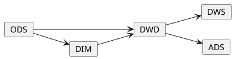
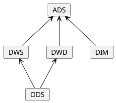

## 数据仓库概念梳理

### 简介

> 注：此处内容来源于维基百科。

在数据处理领域中，数据仓库(DW 或 DWH)，也被称为企业数据仓库(EDW)。
它是一种用于业务报告和数据分析的系统，通常被认为是商业智能(BI)的核心组件。
数据仓库是一个集成了来自于一个或者多个不同来源的系统数据的中央存储库。
它将当前和历史数据存储在一个位置，用于为整个企业的员工创建分析报告。

存储在仓库中的数据是从运营系统(如营销或者销售)上传的。
数据可能会通过 ODS 与数据清理等操作来确保数据质量，然后再用于最终的分析报告。

ETL 和 ELT 是两种建设数据仓库的主要方式。

> 注：提取(Extract)、转换(Transform)、加载(Load)

### 建设数仓的好处

数据仓库维护来自源系统的信息副本。这种架构提供了以下的好处：

- 将来自多个来源的数据集成到单个数据库和数据模型中。因为我们将很多的数据聚合到单个数据库中，所以可以使用单个查询引擎在 ODS 中呈现数据。
- 缓解由于在 OLTP 数据库中运行大型、长时间运行的分析查询而导致的数据库隔离级别锁争用问题。
- 维护数据历史，即使源系统没有。
- 集成来自多个源系统的数据，实现整个企业的中央视图。
- 通过提供一致的代码和描述、标记甚至修复错误数据来提高数据质量。
- 一致地呈现组织信息。
- 不管数据的来源如何，统一为所有相关的数据提供单一通用的数据模型。
- 重构数据模型，使其对业务有实际意义。
- 重构数据模型，使其即使对于复杂的分析查询也能提供出色的查询性能，而不会影响原有系统。
- 为运营业务应用程序增加价值。
- 使决策支持查询更容易编写。
- 组织和消除重复数据的歧义。

### 数据集市

数据集市是在数据仓库环境中的一种数据结构或是访问模式，它经常被用于检索面向客户的数据。
数据集市通常是数据仓库面向特定的业务线或团队的一个子集。
数据仓库通常管理企业范围，而数据集市中的信息则属于单个部门。
在某些情况中，每个部门或业务单位都被视为其数据集市的所有者，包括所有硬件、软件和数据。
这使每个部门能够隔离其数据的使用、操作和开发。
在使用一致维度的其他部署中，此业务单元所有权不适用于客户、产品等共享维度。

建立仓库和数据集市是因为数据库中的信息没有按照易于访问的方式进行组织。
这种组织方式过于复杂、以至于难以访问或进行资源密集型的查询。

虽然 OLTP 旨在更新数据，但数据仓库或集市是只读的。
数据仓库旨在访问大量相关记录。
数据集市通过以支持一组用户的集体视图的方式提供数据，允许用户访问他们最常查看的特定类型的数据，从而缩短了最终用户的响应时间。

数据集市基本上是数据仓库的浓缩和更集中的版本，它反映了组织内每个业务部门的法规和流程规范。
每个数据集市专用于特定的业务功能或区域。
该数据子集可能跨越企业的许多或所有功能主题领域。
通常使用多个数据集市来满足各个业务部门的需求。

### 通用内容

数据仓库和集市的通用环境包括以下内容：

- 向仓库或集市提供数据的源系统
- 数据集成技术和工作流
- 在面对不同用户时提供不同的存储架构
- 为各种用户提供不同的工具和应用程序
- 充分的元数据、完整的数据质量和完善的治理流程，

### 特性

数据仓库定义中数据的基本特性包括

- 面向主题(特定的数据分析领域与目标)
- 数据集成(数据仓库一般都要涉及多个分析主题)
- 反应历史变化(数据仓库中的数据反映历史变化)
- 稳定(数据仓库中的数据是稳定的)

### 数仓分层模型

在阿里巴巴的数据体系中数据仓库被分成了三层，自上而下为： 

- 数据应用层(ADS，Application Data Service)
  - 个性化指标加工：定制化、复杂性指标(复合指标)
  - 基于应用的数据组装：宽表集市、趋势指标
- 数据公共层(CDM，Common Data Model)
  - 纬度表(DIM，Dimension)：建立一致数据分析维表、降低数据计算口径和算法不统一风险
  - 公共汇总层(DWS，Data WareHouse Service)：构建命名规范、口径一致的统计指标，为上层提供公共指标，建立汇总宽表
  - 明细事实表(DWD，Data Warehouse Detail)：基于维表建模，明细宽表，服用关联计算，减少数据扫描
- 数据引入层(ODS，Operation Data Store)
  - 同步：结构化数据增量或全量同步
  - 结构化：非结构化数据进行结构化处理
  - 保存历史、清洗：根据业务、审计、稽查的需求保留历史数据或进行清洗

在阿里的样例中数据流向如下图所示：

此外在其他文章中还有这样的数据流向：

