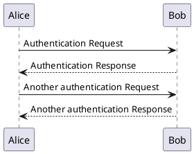

## PlantUML

### 简介

PlantUML 是一个开源项目，支持快速绘制：

- 时序图
- 用例图
- 类图
- 对象图
- 活动图
- 组件图
- 部署图
- 状态图
- 定时图

同时还支持以下非 UML 图:

- JSON Data
- YAML Data
- Network diagram (nwdiag)
- 线框图形界面
- 架构图
- 规范和描述语言 (SDL)
- Ditaa diagram
- 甘特图
- MindMap diagram
- Work Breakdown Structure diagram
- 以 AsciiMath 或 JLaTeXMath 符号的数学公式
- Entity Relationship diagram

此项目就像 Markdown 一样，在编写时采用固定的规范即可书写，但是在显示时却可以展示出图片。非常适合在项目文档中使用，无需将源文件与绘图文件分开保存。

### 在 IDEA 中使用

首先需要在 IDEA 的插件商店安装如下插件

- PlantUML integration

然后就可以在 IDEA 中新建 .puml 文件或者说在 Markdown 中编写如下代码段：

```text

```

显示效果如下：


> 注：在 Markdown 文件编写这样的代码后会在左侧出现下载插件的标识，点击安装后重新渲染文件即可获得图片。

### 与 Hexo 集成

在 `package.json` 配置文件的 `dependencies` 部分新增如下插件即可

```
hexo-filter-plantuml
```

### 参考资料

[中文手册](https://plantuml.com/zh/guide)

[官网](https://plantuml.com)
