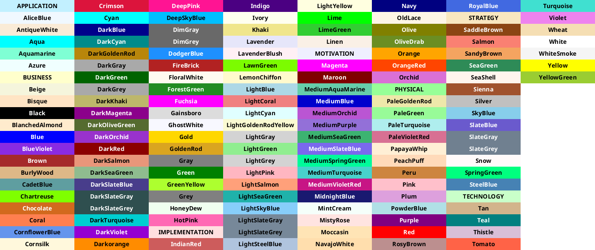

## PlantUML

### 简介

PlantUML 是一个开源项目，支持快速绘制：

- 时序图
- 用例图
- 类图
- 对象图
- 活动图
- 组件图
- 部署图
- 状态图
- 定时图

同时还支持以下非 UML 图:

- JSON Data
- YAML Data
- Network diagram (nwdiag)
- 线框图形界面
- 架构图
- 规范和描述语言 (SDL)
- Ditaa diagram
- 甘特图
- MindMap diagram
- Work Breakdown Structure diagram
- 以 AsciiMath 或 JLaTeXMath 符号的数学公式
- Entity Relationship diagram

此项目就像 Markdown 一样，在编写时采用固定的规范即可书写，但是在显示时却可以展示出图片。非常适合在项目文档中使用，无需将源文件与绘图文件分开保存。

### 在 IDEA 中使用

首先需要在 IDEA 的插件商店安装如下插件

- PlantUML integration

然后就可以在 IDEA 中新建 .puml 文件或者说在 Markdown 中编写代码块，并将其类型指定为 `puml`

> 注：在 Markdown 文件编写代码后会在左侧出现下载插件的标识，点击安装后重新渲染文件即可获得图片。

### 常见问题

#### 找不到 Graphviz 包

可以访问 [Graphviz 下载地址](http://www.graphviz.org/download/) 获取软件包，在下载安装完成后需要重启 IDEA

#### 找不到  Graphviz.dot

在 IDEA puml 文件的工具栏中找到设置按钮，点击 `Open Settings` 选项，然后编辑下面的配置项至指定文件即可

```text
Graphviz dot executable: <graphviz 安装路径>/bin/dot
```

### 与 Hexo 集成

在 `package.json` 配置文件的 `dependencies` 部分新增如下插件即可

```text
hexo-filter-plantuml
```

### 获取颜色

在绘图时可以选择使用十六进制代码来指定颜色，或者可以采用已经完成编码的模板颜色。

模板颜色如下：



也可以通过如下文件展示模板颜色

```text
@startuml
color
@enduml
```

可以使用如下的写法为元素更改颜色

```text
@startuml
rectangle DEMO #Lightblue
@enduml
```

### 获取架构图中可用图形

在绘制架构图时可以使用如下命令，展示可以使用的图形

```text
@startuml
listsprite
@enduml
```

结果如下


### 绘制云平台等复杂图形

plantuml 官方还提供了很多的官方标准库，用于扩展绘图元素。具体内容请参见 [官方标准库](https://plantuml.com/zh/stdlib) 及其 [标准库项目](https://github.com/plantuml/plantuml-stdlib/)

### 参考资料

[中文手册](https://plantuml.com/zh/guide)

[官网](https://plantuml.com)

[官方标准库](https://plantuml.com/zh/stdlib)