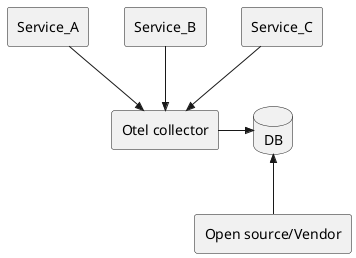

## OpenTelemetry

### 简介

OpenTelemetry 是一个可观测性框架和工具包，旨在创建和管理遥测数据，如跟踪、指标和日志。至关重要的是，OpenTelemetry 与供应商和工具无关，这意味着它可以与各种可观测性后端一起使用，包括 Jaeger 和 Prometheus 等开源工具，以及商业产品。

### 运行方式

OpenTelemetry 在使用过程中可以分成两种角色：

- 开发者
    - 在开发过程中引入 OpenTelemetry 支持如下语言
        - C++
        - .Net
        - Erlang/Elixir
        - Go
        - Java
        - JavaScript/TypeScript
        - PHP
        - Python
        - Ruby
        - Rust
        - Swift
        - Lua
        - Perl
        - Julia
- 运维
    - 运维人员可以在程序运行前添加例如 Java Agent 的方式引入监控，支持如下语言
        - .Net
        - Java
        - JavaScript
        - PHP
        - Python

从使用上来说整体的运行方式如下：

> 注：Otel 为 OpenTelemetry 的缩写且此处的 Open source/Vendor 代表 Jaeger 等可视化工具。

### Kubernetes 部署

可以使用 Helm 部署 OpenTelemetry Collector，具体步骤如下：

[Kubernetes 部署](https://opentelemetry.io/docs/kubernetes/helm/collector/)

### 本地测试

[SigNoz 本地测试](https://signoz.io/docs/install/docker/)

### 参考资料

[官方文档](https://opentelemetry.io/docs/)
